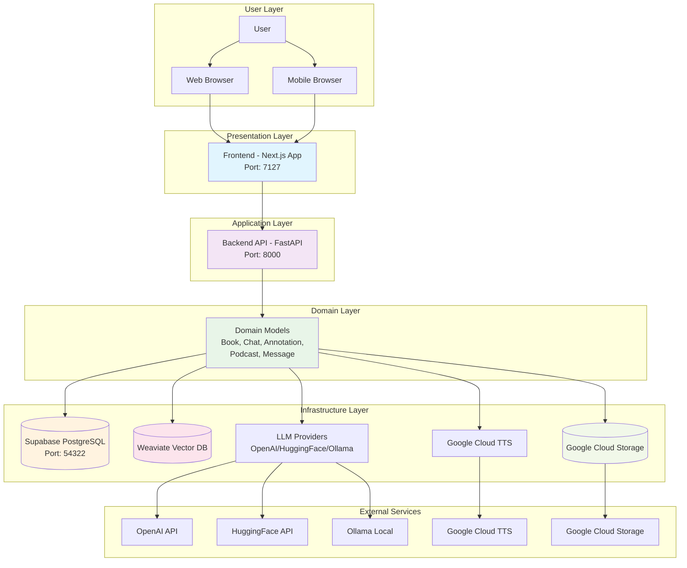
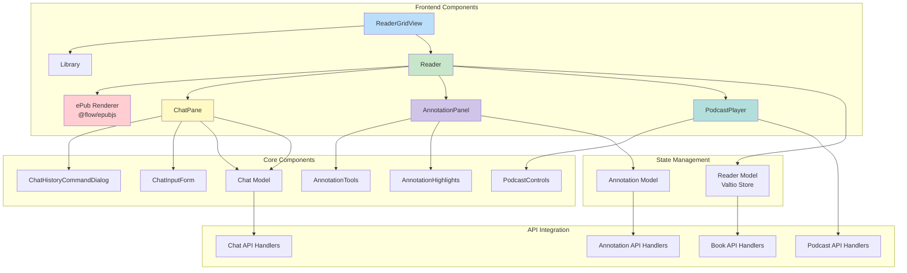
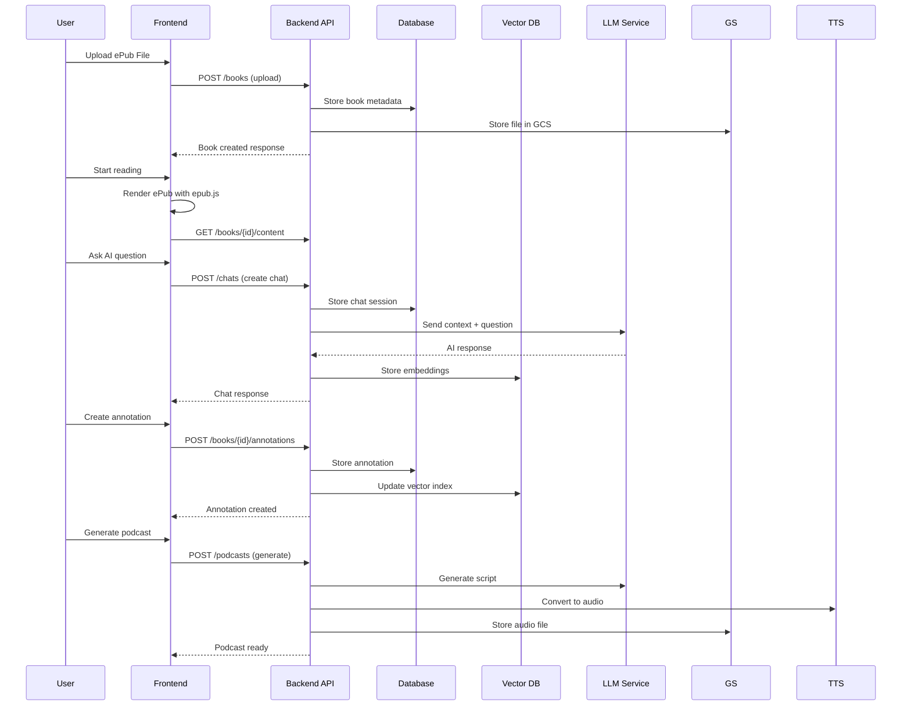
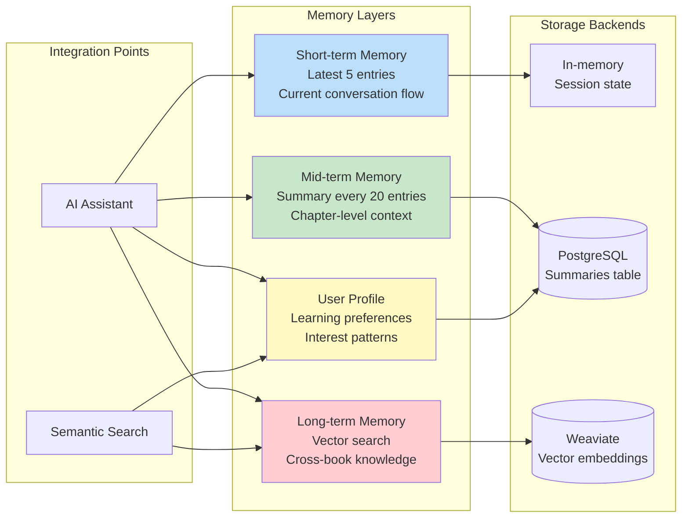
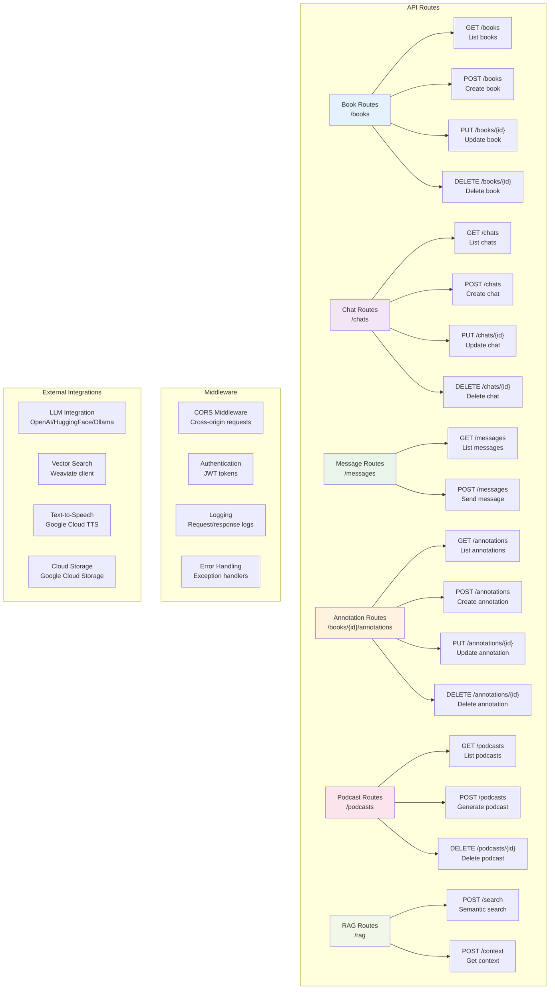
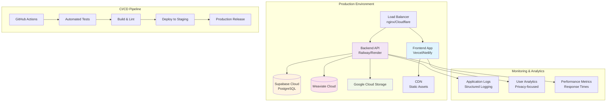

# BookWith Architecture Documentation

## Overview

BookWith is a next-generation conversational e-book reader that transforms traditional reading into an interactive AI-powered experience. The platform enables users to have contextual conversations with AI assistants that understand book content in real-time, generate podcasts from text, and maintain persistent memory across reading sessions.

## Technology Stack

### Frontend Layer
- **Framework**: Next.js 15.3.1 with Pages Router
- **Language**: TypeScript 5.8.3
- **UI Library**: React 19.1.0
- **State Management**: Valtio (proxy-based state management)
- **Styling**: TailwindCSS with custom design system
- **Component Library**: Radix UI primitives
- **Build Tool**: Turborepo monorepo management

### Backend Layer
- **Framework**: FastAPI (Python 3.13+)
- **Architecture**: Domain-Driven Design with Clean Architecture
- **ORM**: SQLAlchemy 2.0+
- **Validation**: Pydantic 2.x
- **API Schema**: OpenAPI 3.0 auto-generated

### Data Layer
- **Primary Database**: Supabase (PostgreSQL 15)
- **Vector Database**: Weaviate for semantic search
- **File Storage**: Google Cloud Storage
- **Client Storage**: IndexedDB for offline capabilities

### AI & External Services
- **LLM Providers**: Multi-provider system (OpenAI GPT-4o, HuggingFace, Ollama)
- **Embedding Models**: Configurable (OpenAI, HuggingFace, Ollama)
- **Text-to-Speech**: Google Cloud Text-to-Speech
- **AI Assistant**: Google Gemini integration
- **Document Processing**: Unstructured.io for file parsing

## System Architecture



## Component Architecture



## Data Flow Architecture



## Domain Architecture

```mermaid
graph TB
    subgraph "Domain Layer"
        subgraph "Core Domains"
            BD[Book Domain] --> BE[Book Entity]
            BD --> BS[Book Service]
            BD --> BR[Book Repository]

            CD[Chat Domain] --> CE[Chat Entity]
            CD --> CS[Chat Service]
            CD --> CR[Chat Repository]

            AD[Annotation Domain] --> AE[Annotation Entity]
            AD --> AS[Annotation Service]
            AD --> AR[Annotation Repository]

            PD[Podcast Domain] --> PE[Podcast Entity]
            PD --> PS[Podcast Service]
            PD --> PR[Podcast Repository]

            MD[Message Domain] --> ME[Message Entity]
            MD --> MS[Message Service]
            MD --> MR[Message Repository]
        end

        subgraph "Cross-Cutting Concerns"
            MM[Memory Management] --> STM[Short-term Memory]
            MM --> MTM[Mid-term Memory]
            MM --> LTM[Long-term Memory]
            MM --> UP[User Profile]

            RS[RAG System] --> VS[Vector Search]
            RS --> CE[Context Enrichment]
            RS --> KR[Knowledge Retrieval]
        end
    end

    subgraph "Infrastructure Layer"
        BR --> PDB[PostgreSQL Repository]
        CR --> PDB
        AR --> PDB
        PR --> PDB
        MR --> PDB

        MM --> VDB[Weaviate Repository]
        RS --> VDB
    end

    style BD fill:#e3f2fd
    style CD fill:#f3e5f5
    style AD fill:#e8f5e8
    style PD fill:#fff3e0
    style MD fill:#fce4ec
```



## Memory Management System



## API Architecture



## Component Explanations

### Core Components

#### 1. **ReaderGridView** (`apps/reader/src/components/ReaderGridView.tsx`)
Main layout component that orchestrates the reading interface. Manages tab-based navigation between different books and provides the grid layout for the reader interface.

#### 2. **Reader** (`apps/reader/src/components/Reader.tsx`)
Core reading component that integrates with the forked epub.js library. Handles ePub rendering, navigation, and coordinates with chat and annotation components.

#### 3. **ChatPane** (`apps/reader/src/components/chat/ChatPane.tsx`)
Real-time chat interface for AI conversations. Manages message history, input handling, and integrates with the multi-layer memory system.

#### 4. **AnnotationPanel** (`apps/reader/src/components/Annotation.tsx`)
Provides highlighting and note-taking capabilities. Supports 5-color annotation system and integrates with AI for contextual insights.

#### 5. **PodcastPlayer** (`apps/reader/src/components/podcast/`)
Audio player component for AI-generated podcasts. Handles playback controls, progress tracking, and integrates with Google Cloud TTS.

### Domain Components

#### 6. **Book Domain** (`apps/api/src/domain/book/`)
Handles book-related business logic including upload, parsing, metadata extraction, and content management.

#### 7. **Chat Domain** (`apps/api/src/domain/chat/`)
Manages conversational AI interactions, message history, and integrates with the memory management system.

#### 8. **Annotation Domain** (`apps/api/src/domain/annotation/`)
Processes user annotations, highlights, and notes. Manages annotation persistence and semantic indexing.

#### 9. **Podcast Domain** (`apps/api/src/domain/podcast/`)
Handles AI podcast generation workflow from script creation to audio synthesis and storage.

#### 10. **Message Domain** (`apps/api/src/domain/message/`)
Manages individual chat messages and their metadata within conversation contexts.

### Infrastructure Components

#### 11. **LLM Integration** (`apps/api/src/infrastructure/llm/`)
Multi-provider LLM abstraction layer supporting OpenAI, HuggingFace, and Ollama. Handles model switching and fallback logic.

#### 12. **Memory Management** (`apps/api/src/infrastructure/memory/`)
Implements the three-tier memory system: short-term (conversation flow), mid-term (chapter summaries), and long-term (vector-based knowledge).

#### 13. **Vector Search** (`apps/api/src/infrastructure/vector.py`)
Weaviate integration for semantic search across books, annotations, and conversation history.

#### 14. **External Services** (`apps/api/src/infrastructure/external/`)
Integrations with Google Cloud Storage, Google Cloud TTS, and document processing services.

### Shared Libraries

#### 15. **@flow/epubjs** (`packages/epubjs/`)
Forked and enhanced ePub.js library for advanced e-book rendering, navigation, and annotation support.

#### 16. **@flow/internal** (`packages/internal/`)
Shared TypeScript utilities and common components used across the monorepo.

#### 17. **@flow/tailwind** (`packages/tailwind/`)
Shared TailwindCSS configuration and design tokens.

## Data Flow Patterns

### 1. **Book Upload Flow**
```
User Upload → Frontend Validation → API Upload Endpoint → File Storage (GCS) → Database Metadata → Content Parsing → Vector Indexing → Response
```

### 2. **AI Chat Flow**
```
User Question → Context Gathering → Memory Retrieval → LLM Query → Response Generation → Memory Update → Vector Storage → UI Update
```

### 3. **Annotation Flow**
```
User Selection → Highlight Creation → Database Storage → Vector Indexing → AI Context Linking → UI Update
```

### 4. **Podcast Generation Flow**
```
Book Selection → Content Extraction → Script Generation (LLM) → Audio Synthesis (TTS) → File Storage → Metadata Update → Playback Ready
```

## External Dependencies & Integrations

### AI & ML Services
- **OpenAI**: Primary LLM for chat interactions (GPT-4o)
- **HuggingFace**: Alternative LLM provider with local model support
- **Ollama**: Local LLM deployment for privacy/offline usage
- **Google Gemini**: AI assistant for advanced reasoning
- **Weaviate**: Vector database for semantic search
- **Sentence Transformers**: Local embedding generation

### Cloud Services
- **Google Cloud Storage**: File storage for books and podcasts
- **Google Cloud Text-to-Speech**: High-quality audio generation
- **Supabase**: Managed PostgreSQL with real-time capabilities

### Development Tools
- **Turbo**: Monorepo build orchestration
- **Supabase CLI**: Local development environment
- **Poetry**: Python dependency management
- **pnpm**: JavaScript package management

## Entry Points & User Interactions

### Primary Entry Points
1. **Web Application** (`http://localhost:7127`): Main user interface
2. **API Endpoints** (`http://localhost:8000`): RESTful API for integrations
3. **File Upload**: Drag-and-drop ePub file handling
4. **PWA Support**: Progressive Web App capabilities

### User Interaction Flows
1. **Reading Flow**: Upload → Browse Library → Open Book → Read with AI Chat
2. **Annotation Flow**: Select Text → Choose Color → Add Notes → AI Insights
3. **Chat Flow**: Ask Questions → Get Contextual Answers → Continue Conversation
4. **Podcast Flow**: Select Content → Generate Audio → Listen Offline
5. **Search Flow**: Semantic Search → Cross-Book Results → Navigate to Content

### Authentication & Authorization
- Currently uses simple user ID system (TEST_USER_ID for development)
- Supabase Auth configured but not fully implemented in UI
- JWT-based API authentication planned for production

## Deployment Architecture



## Security Considerations

### Data Protection
- User content stored in Google Cloud Storage with encryption
- Vector embeddings contain semantic information but not raw text
- API keys managed through environment variables
- CORS configured for production domains

### Privacy Features
- Local LLM support (Ollama) for offline usage
- Client-side processing where possible
- Minimal data collection for analytics
- User-controlled data retention

### Performance Optimizations
- Lazy loading for ePub content
- Vector search caching
- CDN for static assets
- Database connection pooling
- Memory-efficient streaming for large files

This architecture provides a scalable, AI-powered reading platform that balances user experience with technical complexity while maintaining clean separation of concerns across all layers.</content>
<parameter name="filePath">/Users/yash/Documents/practice/bookwith/ARCHITECTURE.md
